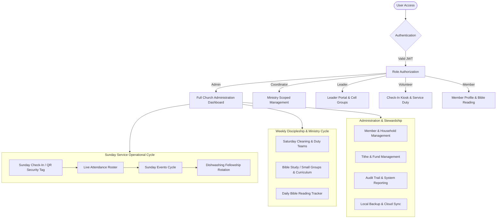
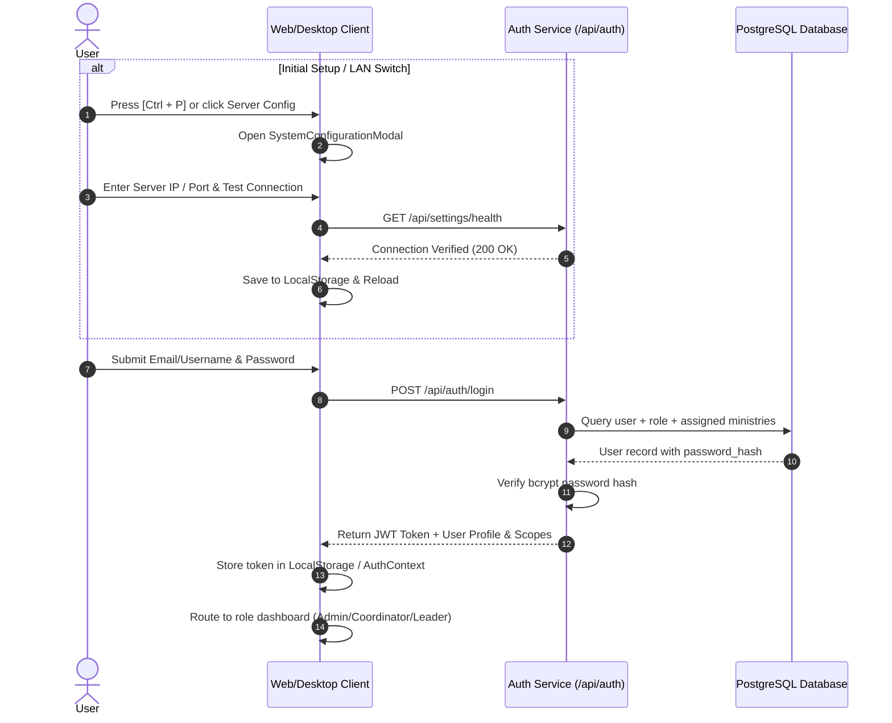
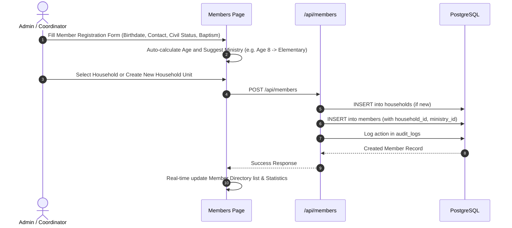
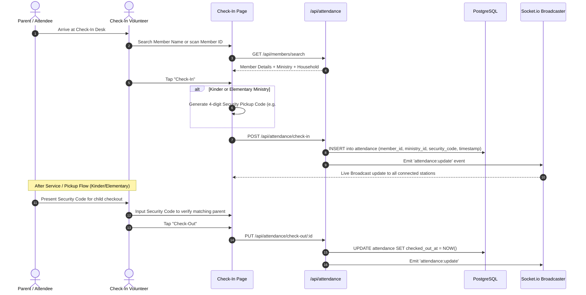
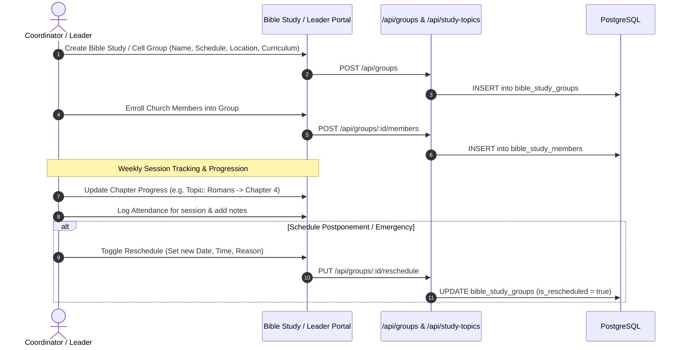
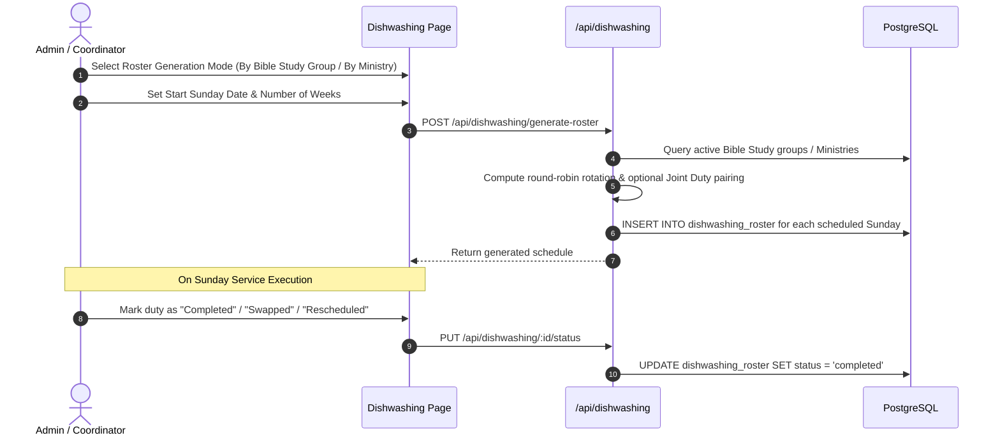
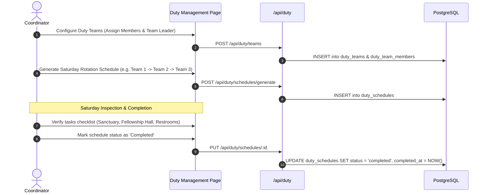
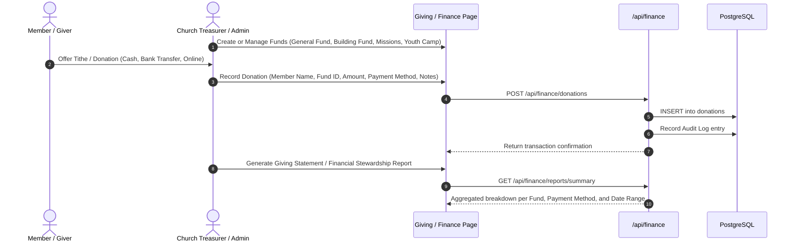
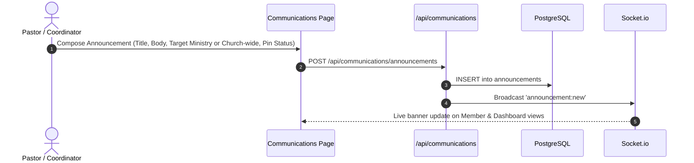
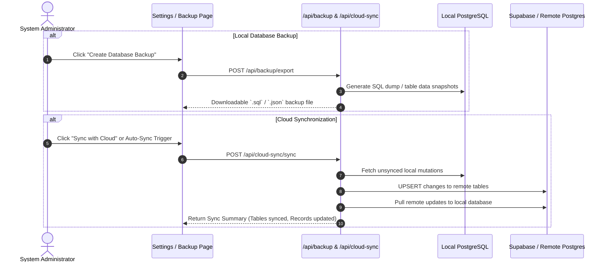

# Daet Presbyterian Church Management System (ChMS) — System Workflow & Architecture Documentation

## 1. System Overview

The **Daet Presbyterian Church Management System (DPC ChMS)** is a comprehensive church management platform engineered to automate administrative operations, discipleship tracking, service management, financial stewardship, and rotating ministry duties.

The system is designed with a **hybrid local-first and cloud-ready architecture**, running as a responsive web application as well as a packaged **Electron desktop application** with support for multi-workstation local area network (LAN) synchronization and remote Supabase cloud backups.

---

## 2. System Architecture & Tech Stack

```
+-----------------------------------------------------------------------------+
|                               Presentation Layer                            |
|  • React 18 (Vite, TypeScript)            • Tailwind CSS (Indigo/Amber UI)  |
|  • Lucide React Icons                     • Responsive Sidebar + Navbar     |
|  • Electron Desktop Shell (Optional)      • Real-time Socket.io Client      |
+-----------------------------------------------------------------------------+
                                       │ HTTP REST / WebSocket
                                       ▼
+-----------------------------------------------------------------------------+
|                             Application Layer (API)                         |
|  • Node.js & Express (TypeScript)         • Role-Based Access Control (RBAC)|
|  • JWT Authentication Middleware          • Socket.io Event Broadcaster     |
|  • Automated Cycle Scheduling Engines     • Backup & Cloud Sync Service     |
+-----------------------------------------------------------------------------+
                                       │ SQL Queries / Pooling
                                       ▼
+-----------------------------------------------------------------------------+
|                              Persistence Layer                              |
|  • PostgreSQL Database                    • 23 Core Relational Tables       |
|  • Indexed Search & Foreign Keys          • Supabase Remote Replication     |
+-----------------------------------------------------------------------------+
```

### Key Technologies
- **Frontend:** React 18, TypeScript, Tailwind CSS, Vite, Lucide Icons, Socket.io Client
- **Backend:** Node.js, Express, TypeScript, Socket.io, Postgres client (`postgres` npm driver)
- **Database:** PostgreSQL (with transaction pooling, connection retry, and migration scripts)
- **Desktop Runtime:** Electron with native system tray and LAN server auto-detection
- **Synchronization:** Bidirectional Cloud Sync with Supabase / Remote Postgres

---

## 3. User Roles & Permission Hierarchy

The system enforces granular Role-Based Access Control (RBAC) across 5 core user roles:

| Role | Scope & Permissions | Target Users |
|---|---|---|
| **Admin** | Unrestricted access across all ministries, users, audit logs, financial data, settings, database backup/restore, and cloud sync. | Senior Pastor, Head Administrator, IT Coordinator |
| **Coordinator** | Management access over assigned ministries (Members, Attendance, Groups, Events, Communications, Reports). | Ministry Directors, Department Heads |
| **Leader** | Dedicated **Leader Portal** to manage assigned Bible Study groups, record group attendance, track curriculum progress, and view member profiles. | Bible Study Leaders, Cell Group Facilitators |
| **Volunteer** | Operational check-in/check-out kiosk execution, Sunday duty tasks, and event assistance. | Service Ushers, Check-in Desk Volunteers |
| **Member** | Read-only personal profile access, personal Bible reading plan tracker, event registration, and church announcements. | Church Members, Regular Attendees |

---

## 4. Ministries Structure

The church is organized into **7 Age-Bracket Ministries**:
1. **Kinder** (Ages 3–5)
2. **Elementary** (Ages 6–12)
3. **Highschool** (Ages 13–16)
4. **Youth** (Ages 17–21)
5. **Young Adult** (Ages 22–35)
6. **Junior Adult** (Ages 36–50)
7. **Old Adult** (Ages 51+)

---

## 5. End-to-End System Workflows



---

### Workflow 5.1: Authentication & Server Configuration



---

### Workflow 5.2: Member Management & Household Linking



#### Key Automation in Member Workflow:
- **Auto-Ministry Suggestion:** Dynamic mapping of birthdate to ministry bracket.
- **Aging-Out Alerts:** Identifies members who have aged out of their current ministry (e.g., Kinder entering Elementary).
- **Baptism Tracking:** Full lifecycle tracking (`not_baptized`, `candidate`, `baptized`) with baptism dates and notes.
- **Household Tree:** Linking parents, spouses, and children in unified family records.

---

### Workflow 5.3: Sunday Service & Check-In Workflow



---

### Workflow 5.4: Discipleship & Bible Study Group Lifecycle



---

### Workflow 5.5: Sunday Dishwashing Fellowship Roster Workflow

To maintain order and fellowship harmony, after-service meal cleanup follows an automated rotational roster.



---

### Workflow 5.6: Saturday Duty & Cleaning Cycle Workflow



---

### Workflow 5.7: Giving & Financial Stewardship Workflow



---

### Workflow 5.8: Church Communications & Announcements



---

### Workflow 5.9: Database Backup, Recovery & Cloud Sync



---

## 6. Page & Navigation Matrix

| Tab Identifier | Component Page | Primary Roles | Key Features |
|---|---|---|---|
| `dashboard` | `DashboardPage.tsx` | Admin, Coordinator | High-level metrics, attendance charts, upcoming duties, recent activity |
| `leaderportal` / `leader-dashboard` | `LeaderPortalPage.tsx` | Leader, Coordinator | Focused view of leader's Bible Study groups, members, attendance logging |
| `attendance` | `CheckInPage.tsx` | Admin, Coordinator, Volunteer | Live Sunday check-in, search, security code generator, live roster |
| `attendancelog` | `AttendanceLogPage.tsx` | Admin, Coordinator, Leader | Unified audit history of Sunday check-ins and Bible Study attendance with CSV/PDF exports |
| `members` | `MembersPage.tsx` | Admin, Coordinator | Directory grid/list, member profile modal, family tree, status filters |
| `biblestudy` | `BibleStudyPage.tsx` | Admin, Coordinator, Leader | Cell group management, curriculum tracker, reschedule manager |
| `curriculum` | `CurriculumPage.tsx` | Admin, Coordinator, Leader | Study topics, chapter outlines, teaching notes and study guides |
| `biblereading` | `BibleReadingPage.tsx` | All Users, Members | 365-day Bible reading plan, progress streaks, chapter bookmarks |
| `duty` | `DutyPage.tsx` | Admin, Coordinator, Leader | Saturday cleaning duty teams, rotation generator, checklist verification |
| `dishwashing` | `DishwashingPage.tsx` | Admin, Coordinator, Leader | Sunday fellowship lunch cleanup roster, joint group assignment |
| `events` | `EventsPage.tsx` | Admin, Coordinator | Church calendar, event registrations/RSVP, location scheduling |
| `sundaycycle` | `SundayEventsCyclePage.tsx` | Admin, Coordinator | Comprehensive master dashboard for all Sunday service logistics |
| `communications` | `CommunicationsPage.tsx` | Admin, Coordinator, Member | Church announcements, bulletins, prayer request management |
| `reports` | `ReportsPage.tsx` | Admin, Coordinator | Attendance trends, demographic charts, export to CSV/PDF |
| `users` | `UsersPage.tsx` | Admin | System user accounts, role assignments, ministry scopes |
| `audit` | `AuditPage.tsx` | Admin | Complete immutable security trail of database modifications |
| `settings` | `SettingsPage.tsx` | Admin | Church profile, system lookups, backup/restore, cloud sync setup |
| `profile` | `ProfilePage.tsx` | All Users | Personal account settings, password update, assigned scopes |

---

## 7. Database Entity Relationship Summary

```
                      +-------------------+
                      |       roles       |
                      +---------+---------+
                                | 1:N
                                ▼
+------------------+     +------+------+     +------------------+
|    ministries    |◀───M:N──|    users    |───1:N──▶|    audit_logs    |
+--------+---------+     +------+------+     +------------------+
         |                      |
         | 1:N                  | 1:N
         ▼                      ▼
+--------+---------+     +------+------+
|     members      |◀──1:N──| households  |
+--------+---------+     +-------------+
         │
         ├─── 1:N ──▶ attendance (Check-in/Check-out, Security Code)
         ├─── 1:N ──▶ event_registrations
         ├─── 1:N ──▶ donations (Tithes/Offerings -> funds)
         ├─── M:N ──▶ bible_study_members (-> bible_study_groups)
         └─── M:N ──▶ duty_team_members (-> duty_teams -> duty_schedules)
```

---

## 8. Operational Quick Guide

### System Shortcuts
- **`Ctrl + P` (or `Cmd + P`):** Open **System Configuration Modal** to change Database Server IP/Host without modifying environment files.

### Standard Weekly Church Operating Cycle
1. **Monday–Friday:** Member updates, Bible Study sessions logging via Leader Portal, Daily Bible Reading Plan check-ins.
2. **Friday Afternoon:** Automated check on Saturday Duty Team assignment & checklist distribution.
3. **Saturday Morning:** Saturday Cleaning Duty execution & completion confirmation.
4. **Sunday Morning (Pre-Service):** Check-In Kiosk startup, Sunday Events Cycle overview verification.
5. **Sunday Morning (During Service):** Attendance logging with pickup security codes for Kinder & Elementary.
6. **Sunday Noon (Post-Service):** Sunday Fellowship Lunch Dishwashing Roster execution & sign-off.
7. **Sunday Evening:** Auto-sync attendance data to Supabase Cloud & trigger weekly database backup.
