# Daet Presbyterian Church Management System (ChMS) — System Workflow & Architecture Documentation

## 1. System Overview

The **Daet Presbyterian Church Management System (DPC ChMS)** is an enterprise-grade church management platform engineered to automate administrative operations, discipleship tracking, worship service management, financial stewardship, rotating ministry duties, and member spiritual growth.

The system is designed with a **hybrid local-first and cloud-ready architecture**, running as a responsive web application as well as a packaged **Electron desktop application** with support for multi-workstation local area network (LAN) synchronization and remote Supabase cloud backups.

---

## 2. System Architecture & Tech Stack

```
+-----------------------------------------------------------------------------+
|                               Presentation Layer                            |
|  • React 18 (Vite, TypeScript)            • Tailwind CSS (Indigo/Amber UI)  |
|  • Lucide React Icons                     • Responsive Sidebar + Navbar     |
|  • Electron Desktop Shell (Optional)      • Real-time Socket.io Client      |
|  • Reactive Toast & Undo Notification     • Interactive Calendar & Modals   |
+-----------------------------------------------------------------------------+
                                       │ HTTP REST / WebSocket
                                       ▼
+-----------------------------------------------------------------------------+
|                             Application Layer (API)                         |
|  • Node.js & Express (TypeScript)         • Role-Based Access Control (RBAC)|
|  • JWT Authentication Middleware          • Socket.io Event Broadcaster     |
|  • Automated Cycle Scheduling Engines     • Attendance Intelligence Engine  |
|  • Backup, Restore & Cloud Sync Service   • Parallel DB Query Optimizations |
+-----------------------------------------------------------------------------+
                                       │ SQL Queries / Pooling
                                       ▼
+-----------------------------------------------------------------------------+
|                              Persistence Layer                              |
|  • PostgreSQL Database (Indexed)          • 24+ Core Relational Tables      |
|  • Service Calendar & Session Authority   • Supabase Remote Replication     |
+-----------------------------------------------------------------------------+
```

### Key Technologies
- **Frontend:** React 18, TypeScript, Tailwind CSS, Vite, Lucide Icons, Socket.io Client
- **Backend:** Node.js, Express, TypeScript, Socket.io, Postgres client (`postgres` npm driver)
- **Database:** PostgreSQL (with transaction pooling, connection retry, performance indexing, and migration scripts)
- **Desktop Runtime:** Electron with native system tray and LAN server auto-detection
- **Synchronization:** Bidirectional Cloud Sync with Supabase / Remote Postgres

---

## 3. User Roles & Permission Hierarchy

The system enforces granular Role-Based Access Control (RBAC) across 5 core user roles:

| Role | Scope & Permissions | Target Users |
|---|---|---|
| **Admin** | Unrestricted access across all ministries, users, audit logs, financial data, service calendars, settings, database backup/restore, year purging, and cloud sync. | Senior Pastor, Head Administrator, IT Coordinator |
| **Coordinator** | Management access over assigned ministries (Members, Attendance, Groups, Events, Communications, Sunday Cycles, Reports). | Ministry Directors, Department Heads |
| **Leader** | Dedicated **Leader Portal** to manage assigned Bible Study groups, record session roll-call, monitor at-risk disciples, schedule meetings, track curriculum progress, and view member profiles. | Bible Study Leaders, Cell Group Facilitators |
| **Volunteer** | Operational check-in/check-out kiosk execution, Sunday duty tasks, event attendance check-in, and service assistance. | Service Ushers, Check-in Desk Volunteers |
| **Member** | Read-only personal profile access, personal 365-day Bible reading plan tracker, scripture alignment, event registration, and church announcements. | Church Members, Regular Attendees |

---

## 4. Ministries Structure

The church is organized into **7 Age-Bracket Ministries**:
1. **Kinder** (Ages 3–5)
2. **Elementary** (Ages 6–12)
3. **Highschool** (Ages 13–16)
4. **Youth** (Ages 17–21)
5. **Young Adult** (Ages 22–35)
6. **Junior Adult** (Ages 36–50)
7. **Old Adult** (Ages 51+)

---

## 5. End-to-End System Workflows

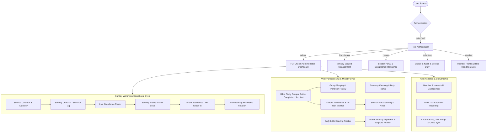
```mermaid
flowchart TD
    A([User Access]) --> B{Authentication}
    B -->|Valid JWT| C[Role Authorization]
    
    C -->|Admin| D[Full Church Administration Dashboard]
    C -->|Coordinator| E[Ministry Scoped Management]
    C -->|Leader| F[Leader Portal & Discipleship Intelligence]
    C -->|Volunteer| G[Check-In Kiosk & Service Duty]
    C -->|Member| H[Member Profile & Bible Reading Guide]

    subgraph SundayCycle [Sunday Worship & Operational Cycle]
        I1[Service Calendar & Authority] --> I2[Sunday Check-In / Security Tag]
        I2 --> J[Live Attendance Roster]
        J --> K1[Sunday Events Master Cycle]
        K1 --> K2[Event Attendance Live Check-In]
        K2 --> L[Dishwashing Fellowship Rotation]
    end

    subgraph WeeklyDiscipleship [Weekly Discipleship & Ministry Cycle]
        M[Saturday Cleaning & Duty Teams]
        N1[Bible Study Groups: Active / Completed / Archived]
        N1 --> N1_Merge[Group Merging & Transition History]
        N1 --> N2[Leader Attendance & At-Risk Monitor]
        N2 --> N3[Session Rescheduling & Notes]
        O1[Daily Bible Reading Tracker]
        O1 --> O2[Plan Catch-Up Alignment & Scripture Reader]
    end

    subgraph AdministrationStewardship [Administration & Stewardship]
        P[Member & Household Management]
        R[Audit Trail & System Reporting]
        S[Local Backup, Year Purge & Cloud Sync]
    end

    D --> SundayCycle
    D --> WeeklyDiscipleship
    D --> AdministrationStewardship
```

---

### Workflow 5.1: Authentication & Dynamic Server Configuration

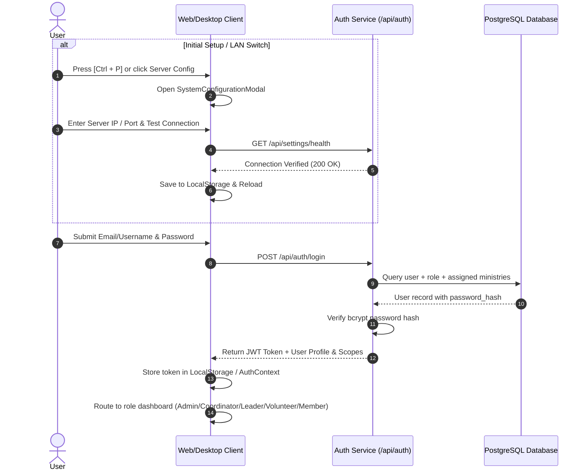
```mermaid
sequenceDiagram
    autonumber
    actor User
    participant Client as Web/Desktop Client
    participant AuthAPI as Auth Service (/api/auth)
    participant DB as PostgreSQL Database

    alt Initial Setup / LAN Switch
        User->>Client: Press [Ctrl + P] or click Server Config
        Client->>Client: Open SystemConfigurationModal
        User->>Client: Enter Server IP / Port & Test Connection
        Client->>AuthAPI: GET /api/settings/health
        AuthAPI-->>Client: Connection Verified (200 OK)
        Client->>Client: Save to LocalStorage & Reload
    end

    User->>Client: Submit Email/Username & Password
    Client->>AuthAPI: POST /api/auth/login
    AuthAPI->>DB: Query user + role + assigned ministries
    DB-->>AuthAPI: User record with password_hash
    AuthAPI->>AuthAPI: Verify bcrypt password hash
    AuthAPI-->>Client: Return JWT Token + User Profile & Scopes
    Client->>Client: Store token in LocalStorage / AuthContext
    Client->>Client: Route to role dashboard (Admin/Coordinator/Leader/Volunteer/Member)
```

---

### Workflow 5.2: Service Calendar & Sunday Worship Management

The Service Calendar provides the authoritative schedule of all regular Sunday Worship and Special Services (Good Friday, Thanksgiving, Watchnight, etc.).

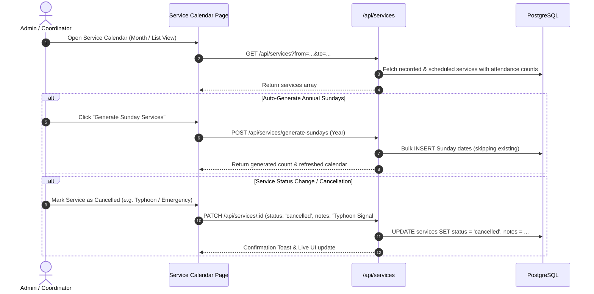
```mermaid
sequenceDiagram
    autonumber
    actor Admin as Admin / Coordinator
    participant UI as Service Calendar Page
    participant API as /api/services
    participant DB as PostgreSQL

    Admin->>UI: Open Service Calendar (Month / List View)
    UI->>API: GET /api/services?from=...&to=...
    API->>DB: Fetch recorded & scheduled services with attendance counts
    API-->>UI: Return services array

    alt Auto-Generate Annual Sundays
        Admin->>UI: Click "Generate Sunday Services"
        UI->>API: POST /api/services/generate-sundays (Year)
        API->>DB: Bulk INSERT Sunday dates (skipping existing)
        API-->>UI: Return generated count & refreshed calendar
    end

    alt Service Status Change / Cancellation
        Admin->>UI: Mark Service as Cancelled (e.g. Typhoon / Emergency)
        UI->>API: PATCH /api/services/:id (status: 'cancelled', notes: 'Typhoon Signal #3')
        API->>DB: UPDATE services SET status = 'cancelled', notes = ...
        API-->>UI: Confirmation Toast & Live UI update
    end
```

---

### Workflow 5.3: Sunday Events Master Cycle & Church Calendar Synchronization

The Sunday Events Cycle manages recurring liturgical events (e.g., 1st Sunday Holy Communion, Youth Sunday, Missions Sunday) and synchronizes them into the active Church Events calendar.

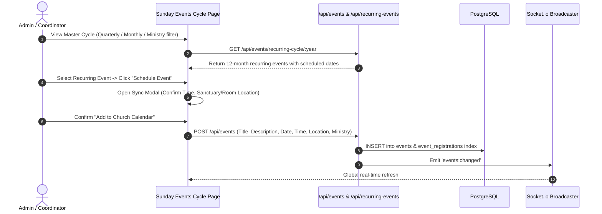
```mermaid
sequenceDiagram
    autonumber
    actor Admin as Admin / Coordinator
    participant UI as Sunday Events Cycle Page
    participant EventsAPI as /api/events & /api/recurring-events
    participant DB as PostgreSQL
    participant Socket as Socket.io Broadcaster

    Admin->>UI: View Master Cycle (Quarterly / Monthly / Ministry filter)
    UI->>EventsAPI: GET /api/events/recurring-cycle/:year
    EventsAPI-->>UI: Return 12-month recurring events with scheduled dates

    Admin->>UI: Select Recurring Event -> Click "Schedule Event"
    UI->>UI: Open Sync Modal (Confirm Time, Sanctuary/Room Location)
    Admin->>UI: Confirm "Add to Church Calendar"
    UI->>EventsAPI: POST /api/events (Title, Description, Date, Time, Location, Ministry)
    EventsAPI->>DB: INSERT into events & event_registrations index
    EventsAPI->>Socket: Emit 'events:changed'
    Socket-->>UI: Global real-time refresh
```

---

### Workflow 5.4: Sunday Check-In, Pickup Security Codes & Live Roster

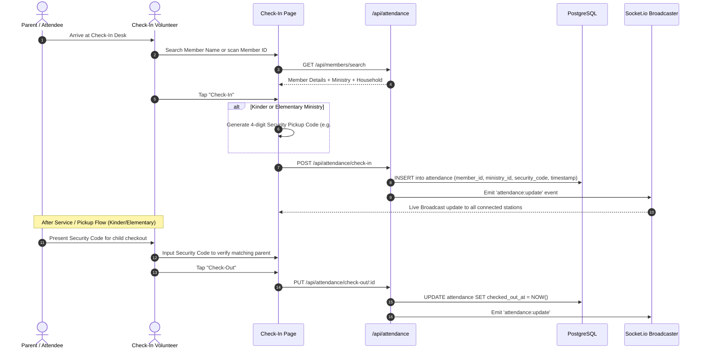
```mermaid
sequenceDiagram
    autonumber
    actor Attendee as Parent / Attendee
    actor Usher as Check-In Volunteer
    participant Kiosk as Check-In Page
    participant AttAPI as /api/attendance
    participant DB as PostgreSQL
    participant Socket as Socket.io Broadcaster

    Attendee->>Usher: Arrive at Check-In Desk
    Usher->>Kiosk: Search Member Name or scan Member ID
    Kiosk->>AttAPI: GET /api/members/search
    AttAPI-->>Kiosk: Member Details + Ministry + Household
    Usher->>Kiosk: Tap "Check-In"
    alt Kinder or Elementary Ministry
        Kiosk->>Kiosk: Generate 4-digit Security Pickup Code (e.g. #K-4821)
    end
    Kiosk->>AttAPI: POST /api/attendance/check-in
    AttAPI->>DB: INSERT into attendance (member_id, ministry_id, security_code, timestamp)
    AttAPI->>Socket: Emit 'attendance:update' event
    Socket-->>Kiosk: Live Broadcast update to all connected stations
    
    Note over Attendee,Usher: After Service / Pickup Flow (Kinder/Elementary)
    Attendee->>Usher: Present Security Code for child checkout
    Usher->>Kiosk: Input Security Code to verify matching parent
    Usher->>Kiosk: Tap "Check-Out"
    Kiosk->>AttAPI: PUT /api/attendance/check-out/:id
    AttAPI->>DB: UPDATE attendance SET checked_out_at = NOW()
    AttAPI->>Socket: Emit 'attendance:update'
```

---

### Workflow 5.5: Leader Portal & Discipleship Attendance Intelligence

The Leader Portal provides small group facilitators with actionable intelligence on disciple consistency, at-risk alerts, and roll-call tools.

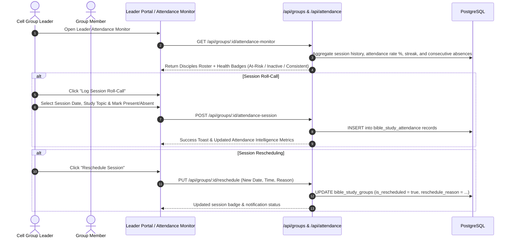
```mermaid
sequenceDiagram
    autonumber
    actor Leader as Cell Group Leader
    actor Disciple as Group Member
    participant Portal as Leader Portal / Attendance Monitor
    participant API as /api/groups & /api/attendance
    participant DB as PostgreSQL

    Leader->>Portal: Open Leader Attendance Monitor
    Portal->>API: GET /api/groups/:id/attendance-monitor
    API->>DB: Aggregate session history, attendance rate %, streak, and consecutive absences
    API-->>Portal: Return Disciples Roster + Health Badges (At-Risk / Inactive / Consistent)

    alt Session Roll-Call
        Leader->>Portal: Click "Log Session Roll-Call"
        Leader->>Portal: Select Session Date, Study Topic & Mark Present/Absent
        Portal->>API: POST /api/groups/:id/attendance-session
        API->>DB: INSERT into bible_study_attendance records
        API-->>Portal: Success Toast & Updated Attendance Intelligence Metrics
    end

    alt Session Rescheduling
        Leader->>Portal: Click "Reschedule Session"
        Portal->>API: PUT /api/groups/:id/reschedule (New Date, Time, Reason)
        API->>DB: UPDATE bible_study_groups (is_rescheduled = true, reschedule_reason = ...)
        API-->>Portal: Updated session badge & notification status
    end
```

---

### Workflow 5.6: Event Attendance & Live Kiosk Check-In

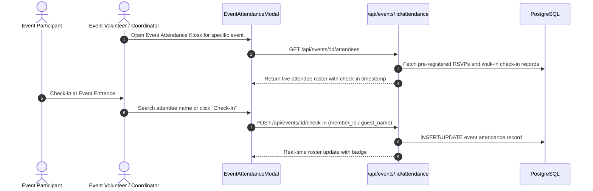
```mermaid
sequenceDiagram
    autonumber
    actor Attendee as Event Participant
    actor Coordinator as Event Volunteer / Coordinator
    participant Modal as EventAttendanceModal
    participant API as /api/events/:id/attendance
    participant DB as PostgreSQL

    Coordinator->>Modal: Open Event Attendance Kiosk for specific event
    Modal->>API: GET /api/events/:id/attendees
    API->>DB: Fetch pre-registered RSVPs and walk-in check-in records
    API-->>Modal: Return live attendee roster with check-in timestamp

    Attendee->>Coordinator: Check-in at Event Entrance
    Coordinator->>Modal: Search attendee name or click "Check-In"
    Modal->>API: POST /api/events/:id/check-in (member_id / guest_name)
    API->>DB: INSERT/UPDATE event attendance record
    API-->>Modal: Real-time roster update with badge
```

---

### Workflow 5.7: Bible Reading Plan, Alignment & Scripture Guide

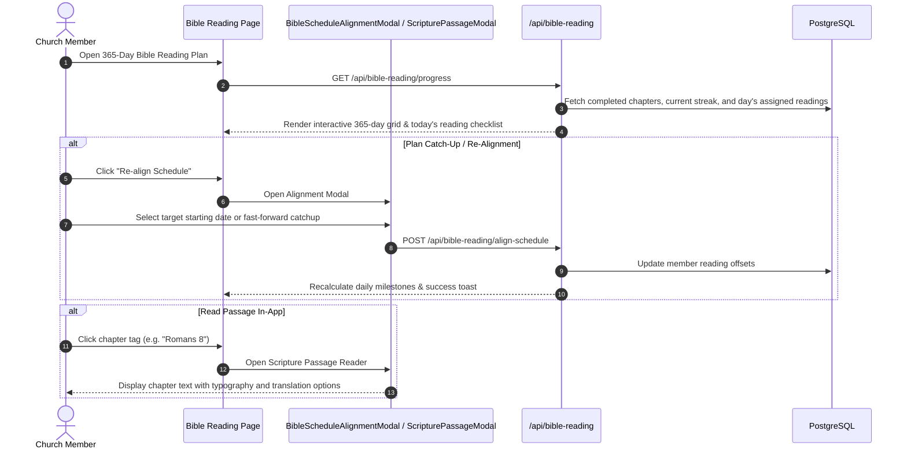
```mermaid
sequenceDiagram
    autonumber
    actor Member as Church Member
    participant UI as Bible Reading Page
    participant Modal as BibleScheduleAlignmentModal / ScripturePassageModal
    participant API as /api/bible-reading
    participant DB as PostgreSQL

    Member->>UI: Open 365-Day Bible Reading Plan
    UI->>API: GET /api/bible-reading/progress
    API->>DB: Fetch completed chapters, current streak, and day's assigned readings
    API-->>UI: Render interactive 365-day grid & today's reading checklist

    alt Plan Catch-Up / Re-Alignment
        Member->>UI: Click "Re-align Schedule"
        UI->>Modal: Open Alignment Modal
        Member->>Modal: Select target starting date or fast-forward catchup
        Modal->>API: POST /api/bible-reading/align-schedule
        API->>DB: Update member reading offsets
        API-->>UI: Recalculate daily milestones & success toast
    end

    alt Read Passage In-App
        Member->>UI: Click chapter tag (e.g. "Romans 8")
        UI->>Modal: Open Scripture Passage Reader
        Modal-->>Member: Display chapter text with typography and translation options
    end
```

---

### Workflow 5.8: Sunday Dishwashing Fellowship Roster Workflow

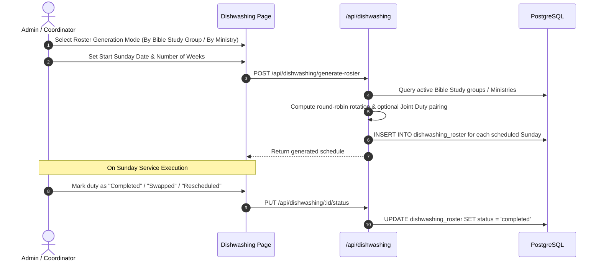
```mermaid
sequenceDiagram
    autonumber
    actor Admin as Admin / Coordinator
    participant UI as Dishwashing Page
    participant API as /api/dishwashing
    participant DB as PostgreSQL

    Admin->>UI: Select Roster Generation Mode (By Bible Study Group / By Ministry)
    Admin->>UI: Set Start Sunday Date & Number of Weeks
    UI->>API: POST /api/dishwashing/generate-roster
    API->>DB: Query active Bible Study groups / Ministries
    API->>API: Compute round-robin rotation & optional Joint Duty pairing
    API->>DB: INSERT INTO dishwashing_roster for each scheduled Sunday
    API-->>UI: Return generated schedule

    Note over Admin,UI: On Sunday Service Execution
    Admin->>UI: Mark duty as "Completed" / "Swapped" / "Rescheduled"
    UI->>API: PUT /api/dishwashing/:id/status
    API->>DB: UPDATE dishwashing_roster SET status = 'completed'
```

---

### Workflow 5.9: Saturday Duty & Cleaning Cycle Workflow

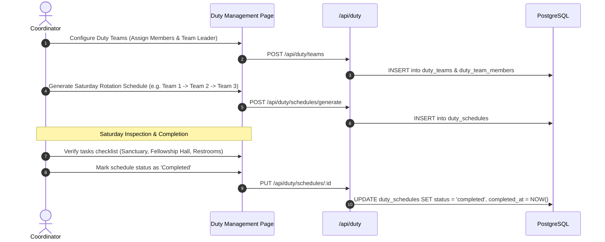
```mermaid
sequenceDiagram
    autonumber
    actor Admin as Coordinator
    participant UI as Duty Management Page
    participant API as /api/duty
    participant DB as PostgreSQL

    Admin->>UI: Configure Duty Teams (Assign Members & Team Leader)
    UI->>API: POST /api/duty/teams
    API->>DB: INSERT into duty_teams & duty_team_members

    Admin->>UI: Generate Saturday Rotation Schedule (e.g. Team 1 -> Team 2 -> Team 3)
    UI->>API: POST /api/duty/schedules/generate
    API->>DB: INSERT into duty_schedules

    Note over Admin,UI: Saturday Inspection & Completion
    Admin->>UI: Verify tasks checklist (Sanctuary, Fellowship Hall, Restrooms)
    Admin->>UI: Mark schedule status as 'Completed'
    UI->>API: PUT /api/duty/schedules/:id
    API->>DB: UPDATE duty_schedules SET status = 'completed', completed_at = NOW()
```

---

### Workflow 5.10: Cloud Synchronization, Year Purge & Disaster Recovery

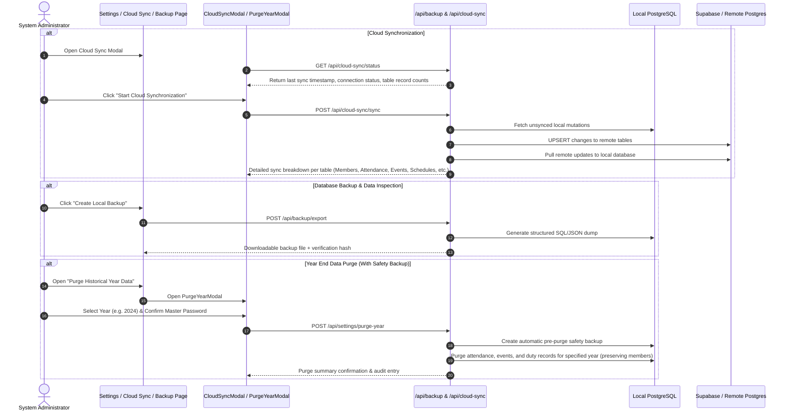
```mermaid
sequenceDiagram
    autonumber
    actor Admin as System Administrator
    participant UI as Settings / Cloud Sync / Backup Page
    participant Modal as CloudSyncModal / PurgeYearModal
    participant BackupAPI as /api/backup & /api/cloud-sync
    participant LocalDB as Local PostgreSQL
    participant CloudDB as Supabase / Remote Postgres

    alt Cloud Synchronization
        Admin->>UI: Open Cloud Sync Modal
        Modal->>BackupAPI: GET /api/cloud-sync/status
        BackupAPI-->>Modal: Return last sync timestamp, connection status, table record counts
        Admin->>Modal: Click "Start Cloud Synchronization"
        Modal->>BackupAPI: POST /api/cloud-sync/sync
        BackupAPI->>LocalDB: Fetch unsynced local mutations
        BackupAPI->>CloudDB: UPSERT changes to remote tables
        BackupAPI->>CloudDB: Pull remote updates to local database
        BackupAPI-->>Modal: Detailed sync breakdown per table (Members, Attendance, Events, Schedules, etc.)
    end

    alt Database Backup & Data Inspection
        Admin->>UI: Click "Create Local Backup"
        UI->>BackupAPI: POST /api/backup/export
        BackupAPI->>LocalDB: Generate structured SQL/JSON dump
        BackupAPI-->>UI: Downloadable backup file + verification hash
    end

    alt Year End Data Purge (With Safety Backup)
        Admin->>UI: Open "Purge Historical Year Data"
        UI->>Modal: Open PurgeYearModal
        Admin->>Modal: Select Year (e.g. 2024) & Confirm Master Password
        Modal->>BackupAPI: POST /api/settings/purge-year
        BackupAPI->>LocalDB: Create automatic pre-purge safety backup
        BackupAPI->>LocalDB: Purge attendance, events, and duty records for specified year (preserving members)
        BackupAPI-->>Modal: Purge summary confirmation & audit entry
    end
```

---

### Workflow 5.11: Bible Study Groups Lifecycle, Transitions, Soft-Delete & Member Enrollment

```mermaid
sequenceDiagram
    autonumber
    actor Admin as Admin / Pastor / Coordinator
    participant UI as Bible Study Page
    participant Modal as Create/Edit/Transition Modal
    participant API as /api/groups
    participant DB as PostgreSQL

    %% 1. Creation & Member Enrollment
    alt Group Creation with Role & Ministry Filtering
        Admin->>UI: Click "New Bible Study Group"
        UI->>API: GET /api/users (Filter: Coordinator, Leader, Pastor)
        UI->>API: GET /api/members (Filter: Unenrolled members without active group)
        Admin->>Modal: Select Leader, Ministry Scope, and choose members by Ministry Filter
        Note over Admin,Modal: Max Capacity Validation (e.g. Max 12)
        alt Capacity Limit Reached
            Modal-->>Admin: Show "⚠️ Full (Max 12)" badge & block extra member selections
        end
        Admin->>Modal: Submit Form (Validates selected <= max_capacity)
        Modal->>API: POST /api/groups
        API->>DB: INSERT bible_study_groups & bible_study_members
        API-->>UI: Real-time update via WebSockets
    end

    %% 2. Study Completion
    alt Mark Group as Completed
        Admin->>UI: Click "Complete Study"
        UI->>Modal: Open CompleteGroupModal
        Admin->>Modal: Confirm finished chapter (e.g. Chapter 12 of 12) & notes
        Modal->>API: POST /api/groups/:id/complete
        API->>DB: UPDATE status = 'completed', completed_at = NOW(), save curriculum snapshot
        API-->>UI: Move group to "Completed" filter (Emerald card with snapshot)
    end

    %% 3. Soft-Delete / Archiving
    alt Archive (Soft-Delete) & Restore Group
        Admin->>UI: Click "Archive Group"
        UI->>Modal: Open Archive Confirmation Modal (Prompt optional reason)
        Admin->>Modal: Confirm Archive
        Modal->>API: POST /api/groups/:id/archive (or DELETE /api/groups/:id)
        API->>DB: UPDATE status = 'archived', archived_at = NOW(), archived_by, archive_reason (No hard delete)
        API-->>UI: Move group to "Archived" filter

        alt Restore Group
            Admin->>UI: Click "Restore Group" on Archived card
            UI->>API: POST /api/groups/:id/restore
            API->>DB: Check name conflict with active groups -> UPDATE status = 'active'
            API-->>UI: Reactivate group back to "Active" list
        end
    end

    %% 4. Group Merge & Transitions
    alt Group Merge Transition
        Admin->>UI: Click "Group Transition" -> Select "Merge Groups"
        Admin->>Modal: Select Source Groups A & B -> Configure Resulting Group & Leader
        Modal->>API: POST /api/groups/transitions/merge
        API->>DB: BEGIN Transaction
        API->>DB: INSERT new merged group (status = 'active')
        API->>DB: UPDATE source groups SET status = 'merged', merged_into_group_id = new_id
        API->>DB: Consolidate memberships into new group & record transition audit
        API->>DB: COMMIT Transaction
        API-->>UI: Hide source groups from normal lists; Display resulting merged group & update "Transitions Log"
    end
```

---

## 6. Page & Navigation Matrix

| Tab Identifier | Component Page | Primary Roles | Key Features |
|---|---|---|---|
| `dashboard` | `DashboardPage.tsx` | Admin, Coordinator | High-level metrics, attendance charts, upcoming duties, recent activity |
| `servicecalendar` | `ServiceCalendarPage.tsx` | Admin, Coordinator | Sunday & special service calendar, status tracking (held/cancelled), auto-generator |
| `sundaycycle` | `SundayEventsCyclePage.tsx` | Admin, Coordinator | 12-month master cycle, liturgical pattern scheduling, one-click church calendar sync |
| `leaderportal` / `leader-dashboard` | `LeaderPortalPage.tsx`, `LeaderDashboard.tsx` | Leader, Coordinator | Focused view of leader's Bible Study groups, roll-call, at-risk disciples monitoring |
| `leader-attendance` | `LeaderAttendanceMonitor.tsx` | Leader, Coordinator | Deep attendance intelligence, absence streaks, disciple health badges, session history |
| `attendance` | `CheckInPage.tsx` | Admin, Coordinator, Volunteer | Live Sunday check-in, search, security code generator, live roster |
| `attendancelog` | `AttendanceLogPage.tsx` | Admin, Coordinator, Leader | Unified audit history of Sunday check-ins and Bible Study attendance with CSV/PDF exports |
| `members` | `MembersPage.tsx` | Admin, Coordinator | Directory grid/list, member profile modal, family tree, status filters, individual attendance summary |
| `biblestudy` | `BibleStudyPage.tsx` | Admin, Coordinator, Leader | Full lifecycle management (Active, Completed, Archived, All), Group Transitions & Merge Wizard, Church-wide Transitions Log, Leader role filtering (Coordinator/Leader/Pastor), Unenrolled Member Ministry Filter, Max Capacity validation, Soft-delete & Restore, Curriculum progress tracking, and Reschedule manager |
| `curriculum` | `CurriculumPage.tsx` | Admin, Coordinator, Leader | Study topics, chapter outlines, teaching notes, active/ongoing/completed group pacing |
| `biblereading` | `BibleReadingPage.tsx` | All Users, Members | 365-day Bible reading plan, progress streaks, schedule alignment modal, in-app scripture reader |
| `duty` | `DutyPage.tsx` | Admin, Coordinator, Leader | Saturday cleaning duty teams, rotation generator, checklist verification |
| `dishwashing` | `DishwashingPage.tsx` | Admin, Coordinator, Leader | Sunday fellowship lunch cleanup roster, joint group assignment |
| `events` | `EventsPage.tsx` | Admin, Coordinator | Church calendar, event registrations/RSVP, live event check-in kiosk modal |
| `communications` | `CommunicationsPage.tsx` | Admin, Coordinator, Member | Church announcements, bulletins, prayer request management |
| `notifications` | `NotificationsPage.tsx` | All Users | User-scoped alerts, unread filters, deep links, read/unread controls, deletion and pagination |
| `reports` | `ReportsPage.tsx` | Admin, Coordinator | Attendance trends, demographic charts, export to CSV/PDF |
| `users` | `UsersPage.tsx` | Admin | System user accounts, role assignments, ministry scopes |
| `audit` | `AuditPage.tsx` | Admin | Complete immutable security trail of database modifications |
| `settings` | `SettingsPage.tsx` | Admin | Church profile, system lookups, notification/email rules, encrypted SMTP settings, backup/restore, year purge, cloud sync modal |
| `profile` | `ProfilePage.tsx` | All Users | Personal account settings, password update, assigned scopes |

---

## 7. Database Entity Relationship Summary

```
                      +-------------------+
                      |       roles       |
                      +---------+---------+
                                | 1:N
                                ▼
+------------------+     +------+------+     +------------------+
|    ministries    |◀───M:N──|    users    |───1:N──▶|    audit_logs    |
+--------+---------+     +------+------+     +------------------+
         |                      |
         | 1:N                  | 1:N
         ▼                      ▼
+--------+---------+     +------+------+     +------------------+
|     members      |◀──1:N──| households  |     |     services     |
+--------+---------+     +-------------+     +--------+---------+
         │                                            │ (Authority)
         ├─── 1:N ──▶ attendance (Check-in/Check-out) ◀
         ├─── 1:N ──▶ event_registrations (-> events)
         ├─── M:N ──▶ bible_study_members (-> bible_study_groups -> bible_study_attendance)
         └─── M:N ──▶ duty_team_members (-> duty_teams -> duty_schedules)
```

---

## 8. Operational Quick Guide

### System Shortcuts & Notification Feedback
- **`Ctrl + P` (or `Cmd + P`):** Open **System Configuration Modal** to change Database Server IP/Host without modifying environment files.
- **Toast Notifications with Undo:** Critical delete operations (such as deleting recurring events or sessions) display an instant toast with a reversible "Undo" action.

### Standard Weekly Church Operating Cycle
1. **Monday–Friday:** Member updates, Bible Study roll-call and at-risk disciple follow-up via Leader Portal, Daily Bible Reading Plan check-ins and scripture reading.
2. **Friday Afternoon:** Automated check on Saturday Duty Team assignment & checklist distribution.
3. **Saturday Morning:** Saturday Cleaning Duty execution & completion confirmation.
4. **Sunday Morning (Pre-Service):** Check-In Kiosk startup, Service Calendar status verification, Sunday Events Cycle overview.
5. **Sunday Morning (During Service):** Attendance logging with pickup security codes for Kinder & Elementary.
6. **Sunday Noon (Post-Service):** Sunday Fellowship Lunch Dishwashing Roster execution & sign-off.
7. **Sunday Afternoon / Evening:** Synchronize operational data to Supabase Cloud and create the weekly database backup.
