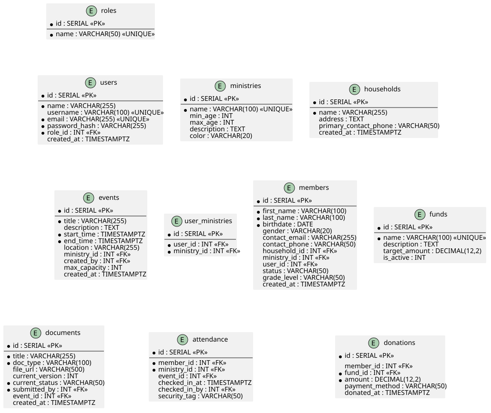
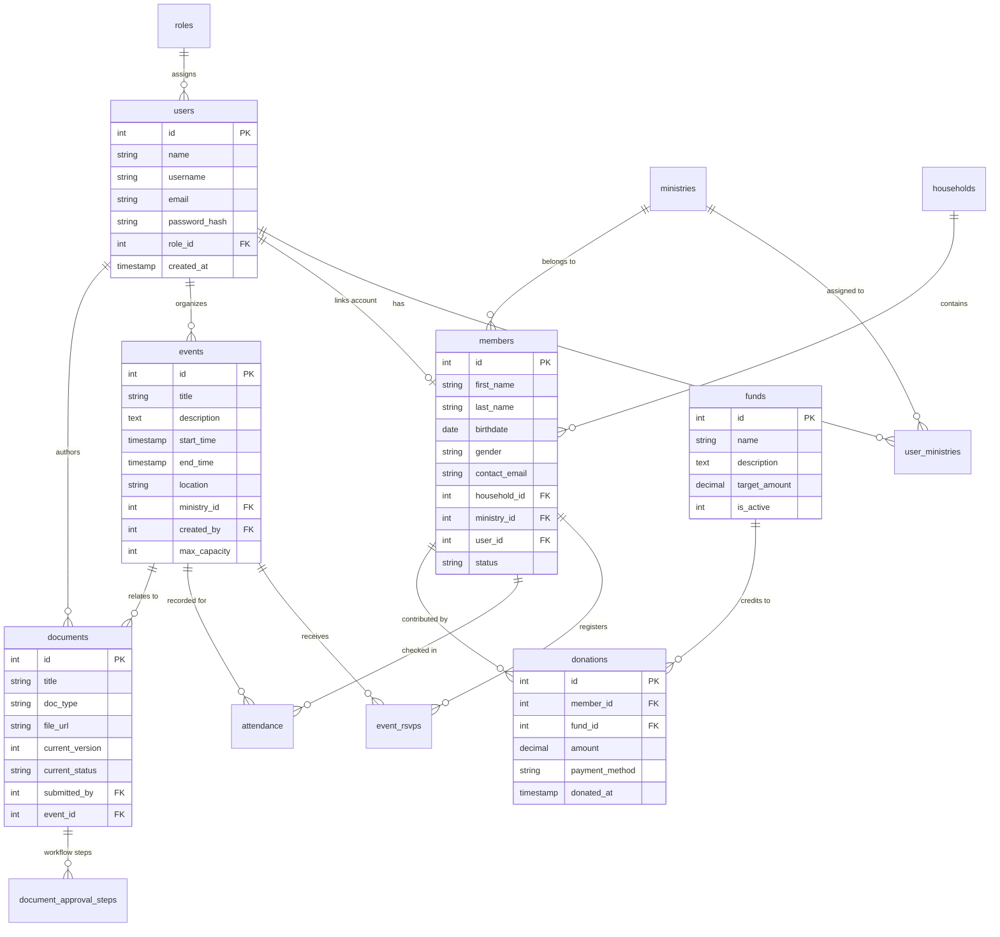
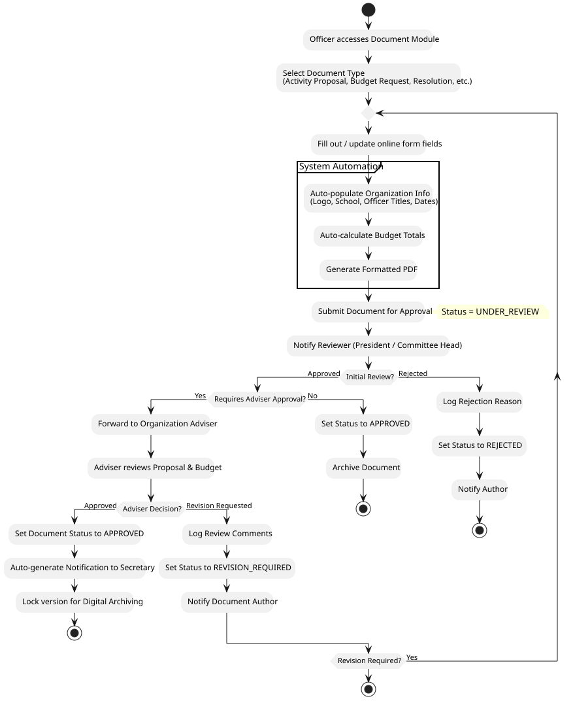
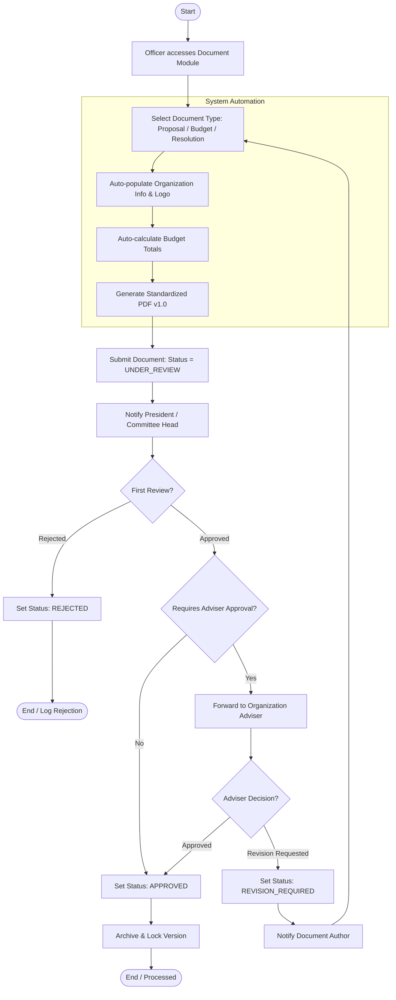
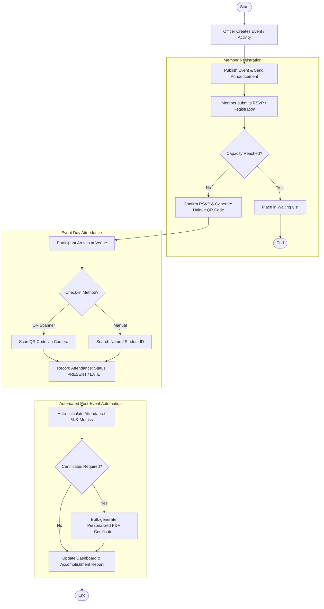
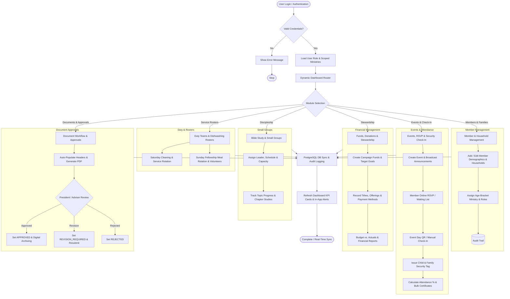

# System Diagrams (Visual Previews & Sources)

This directory contains the visual diagrams and PlantUML source files for the **CYF Christian School Organization Management System**.

---

## 1. Entity-Relationship Diagram (ERD)

### Visual Preview

### Native Markdown ERD (Mermaid)

*PlantUML Source file:* [`erd.puml`](./erd.puml)

---

## 2. Document Approval & Versioning Flowchart

### Visual Preview

### Native Markdown Flowchart (Mermaid)

*PlantUML Source file:* [`document_approval_flowchart.puml`](./document_approval_flowchart.puml)

---

## 3. Event Registration & QR Attendance Flowchart

### Native Markdown Flowchart (Mermaid)

*PlantUML Source file:* [`event_attendance_flowchart.puml`](./event_attendance_flowchart.puml)

---

## 4. End-to-End System Flowchart (Comprehensive Architecture & Lifecycle)

### Native Markdown Flowchart (Mermaid)

*PlantUML Source file:* [`system_flowchart.puml`](./system_flowchart.puml)
